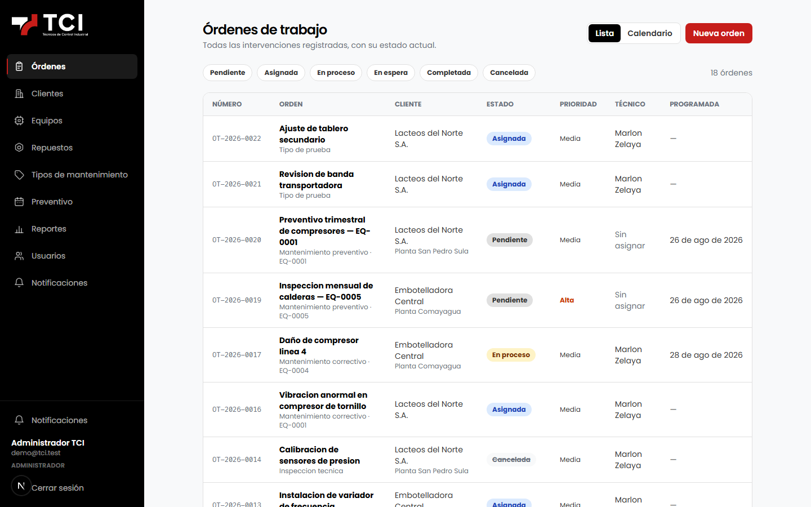
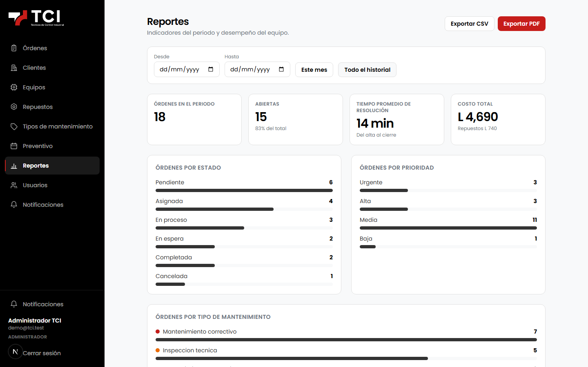
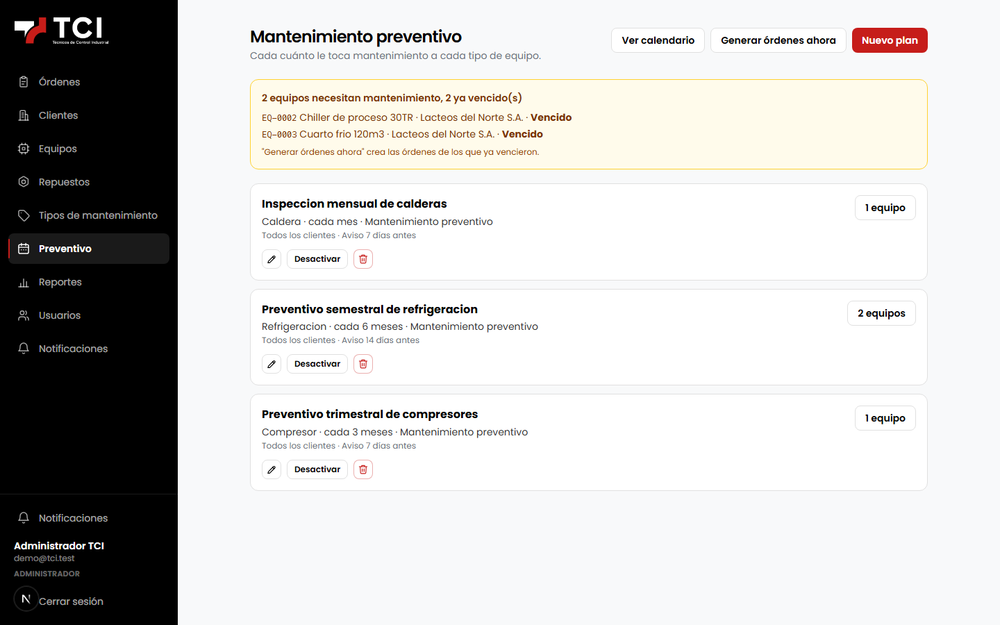
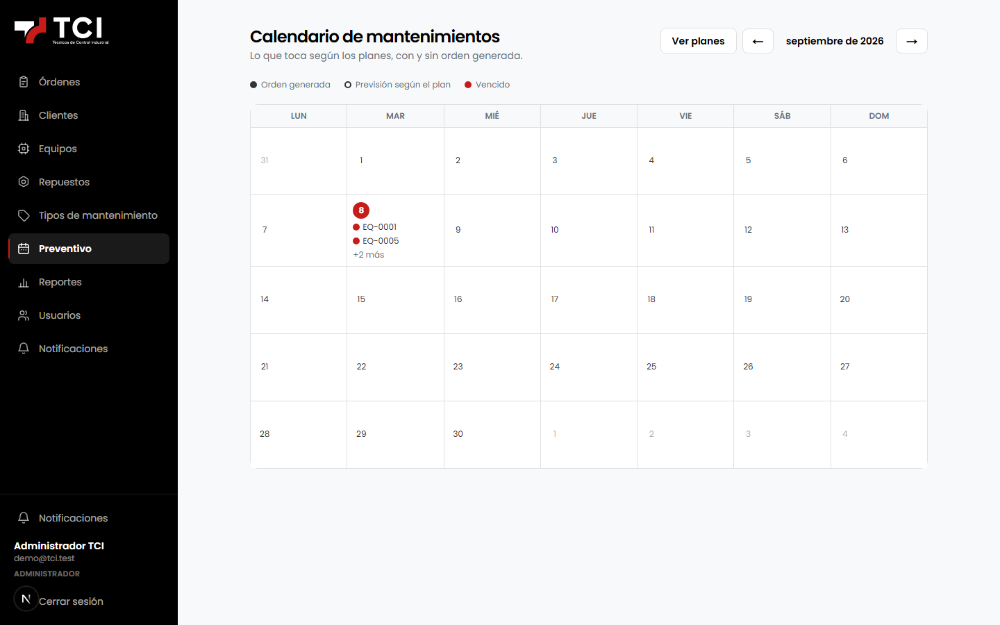
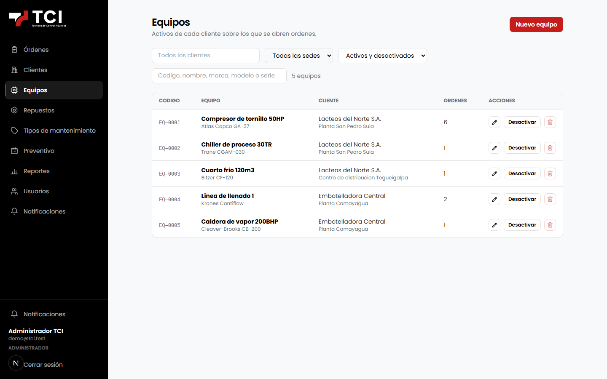
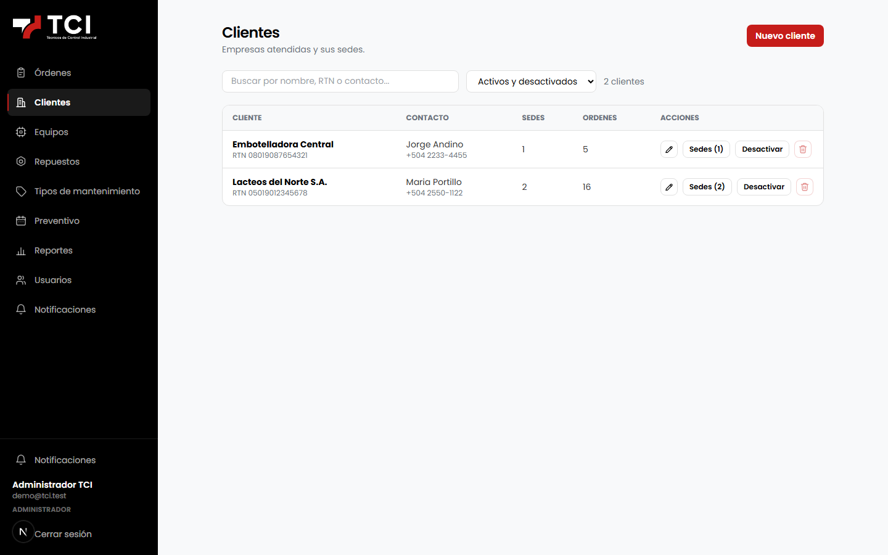
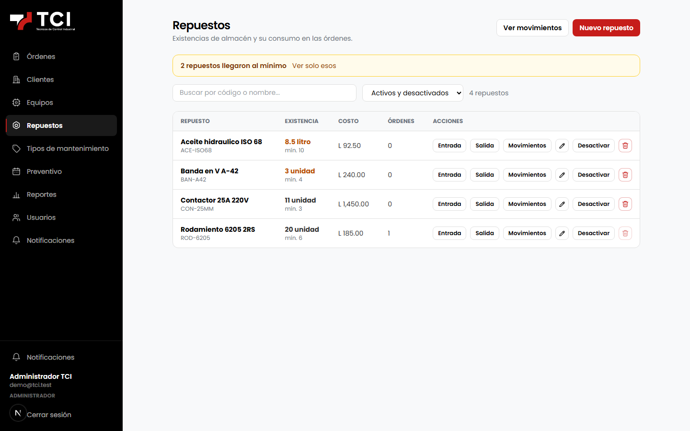
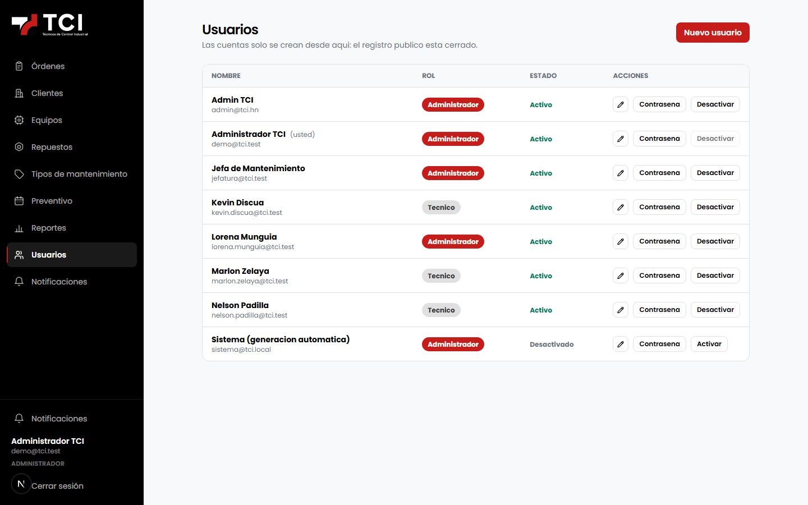

<div align="center">

# TCI CMMS

### Gestión de mantenimiento industrial: órdenes de trabajo, activos y preventivo

### [🔧 tci.brandsofts.com](https://tci.brandsofts.com)

[](LICENSE)
[](https://nodejs.org/)
[](https://nestjs.com/)
[](https://nextjs.org/)
[](https://www.postgresql.org/)

Un CMMS para una empresa de servicios de mantenimiento: la orden de trabajo
nace, se asigna a un técnico, se ejecuta con evidencia y se cierra con firma —
y el equipo intervenido conserva su historial completo.



</div>

## Qué resuelve

Una empresa que da mantenimiento a terceros vive de coordinar tres cosas que no
suelen estar en el mismo sitio: **qué hay que atender**, **quién lo atendió** y
**con qué evidencia**. Sin un sistema, eso vive en WhatsApp, en una hoja de
cálculo y en la memoria del técnico que ese día fue a la planta.

TCI CMMS pone esas tres cosas sobre la misma orden de trabajo, y deja el rastro
que hace falta cuando el cliente pregunta qué se hizo en su compresor hace seis
meses.

| Módulo | Qué hace |
| --- | --- |
| **Órdenes de trabajo** | Alta, asignación, estados, prioridad, checklist, firma y cierre |
| **Clientes y sedes** | Cada cliente con sus plantas, y los equipos que hay en cada una |
| **Equipos** | Ficha del activo con su historial completo de intervenciones |
| **Preventivo** | Planes por frecuencia que generan órdenes solas, con calendario |
| **Repuestos** | Inventario, movimientos y consumo imputado a la orden |
| **Evidencia** | Adjuntos y fotos por orden, guardados en S3 |
| **Reportes** | Indicadores del periodo y desempeño por técnico, exportables a CSV y PDF |
| **Notificaciones** | Avisos por evento, en la app y por correo |
| **Usuarios** | Roles de administrador y técnico, con alta cerrada |

## Cómo se ve

### Reportes

Indicadores del periodo, reparto por estado, prioridad y tipo, y una tabla de
desempeño por técnico con horas y costo.



### Mantenimiento preventivo

Los planes generan las órdenes por sí solos según su frecuencia, y el calendario
enseña qué toca y cuándo.

<table>
<tr>
<td width="50%"></td>
<td width="50%"></td>
</tr>
<tr>
<td><b>Planes</b> — frecuencia, anticipación y prioridad</td>
<td><b>Calendario</b> — lo programado, mes a mes</td>
</tr>
<tr>
<td></td>
<td></td>
</tr>
<tr>
<td><b>Equipos</b> — el activo y su historial</td>
<td><b>Clientes</b> — con sus sedes y equipos</td>
</tr>
<tr>
<td></td>
<td></td>
</tr>
<tr>
<td><b>Repuestos</b> — inventario y movimientos</td>
<td><b>Usuarios</b> — administradores y técnicos</td>
</tr>
</table>

> Las capturas salen de una instancia local con datos inventados: ni los
> clientes, ni los equipos, ni las órdenes corresponden a operaciones reales.

## Arquitectura

```
  panel (Next.js 15) ──▶ API (NestJS 11) ──▶ PostgreSQL 18 (Prisma)
                                         └─▶ S3 · evidencia de las órdenes
                                         └─▶ SMTP · avisos por correo
```

| Componente | Tecnología | Puerto local |
| --- | --- | --- |
| `frontend/` | Next.js 15, React, TypeScript | **3000** |
| `backend/` | NestJS 11, Prisma, Better Auth | **3001** (`/api`) |
| PostgreSQL | 18 | **5436** |

El registro público está **cerrado a propósito** (`disableSignUp`): las cuentas
las crea un administrador, y el primer administrador lo crea el seed. Es un
sistema interno, no un servicio al que alguien se apunta.

## Puesta en marcha

Requisitos: **Node 20+** y **Docker**.

```bash
git clone https://github.com/esdrasclth/tci-cmms.git
cd tci-cmms
cp .env.example .env                  # revisa los valores antes de seguir

docker compose up -d postgres         # PostgreSQL en el 5436

cd backend
npm install
cp .env.example .env
npx prisma migrate deploy
SEED_ADMIN_EMAIL=admin@ejemplo.com SEED_ADMIN_PASSWORD=... npm run db:seed
npm run start:dev                     # http://localhost:3001/api

cd ../frontend
npm install
npm run dev                           # http://localhost:3000
```

Sin ejecutar el seed **no hay forma de entrar**: como el alta pública está
cerrada, el administrador inicial tiene que salir de ahí.

También puedes levantar todo con `docker compose up`, que incluye backend y
frontend además de la base.

## Estructura

```text
backend/
  src/
    ordenes/       órdenes de trabajo, su ciclo y su historial
    preventivo/    planes y generación automática
    equipos/       activos y su ficha
    clientes/      clientes y sedes
    inventario/    repuestos y movimientos
    adjuntos/      evidencia en S3
    reportes/      indicadores y exportación
    notificaciones/ avisos por evento
    auth/          Better Auth, roles y sesiones
  prisma/          esquema, migraciones y seed
frontend/
  src/app/(auth)/  login y recuperación
  src/app/panel/   el sistema
docs/              flujo de órdenes, modelo de datos y despliegue
scripts/           respaldo de la base
```

## Documentación

| Documento | De qué trata |
| --- | --- |
| [`flujo-ordenes.md`](docs/flujo-ordenes.md) | El ciclo de una orden, estado por estado |
| [`modelo-datos-orden.md`](docs/modelo-datos-orden.md) | Cómo está modelada la orden y por qué |
| [`despliegue.md`](docs/despliegue.md) | Puesta en producción |

## Contribuir

[`CONTRIBUTING.md`](CONTRIBUTING.md) explica el entorno, las convenciones y qué
comprobar antes de abrir un pull request.

## Licencia

**[GNU AGPL v3](LICENSE)**. Puedes usar, estudiar y modificar el sistema. Si lo
despliegas y das acceso a otras personas por red, tienes que publicar tu versión
del código con la misma licencia.
